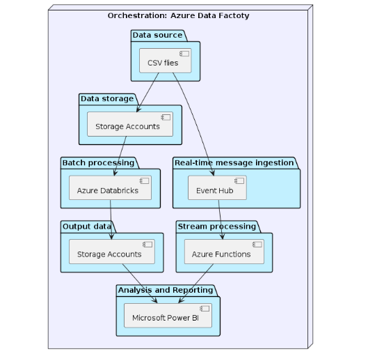

# Taxi-Data Processing System

# Overview:
New York City Taxi Data Processing System
Our team developed a comprehensive data processing system that handles data collected from New York City's taxis. This system leverages the capabilities of the Microsoft Azure platform, utilizing its various services to ensure efficient data handling and processing.

## Key Features:

* Data Collection and Processing: The system ingests and processes large volumes of data collected from New York City's taxi operations, including trip details, fare information, and other relevant metrics.
* Stream Processing: The system implements a pub/sub idea for stream-processing of data. 
* Scalability: By leveraging Azure's robust infrastructure, our system is designed to scale efficiently to handle varying loads of data, ensuring smooth operation even during peak times.
* Fault Tolerance: The system architecture includes multiple components that provide fault tolerance, ensuring high availability and reliability. In case of any component failure, the system can continue to operate without significant downtime.
* Azure Services Utilization: We have integrated various Azure services such as **Azure Data Factory**, **Azure Databricks**, **Azure Blob Storage** to build a resilient and efficient data processing pipeline.

## Technologies Used:

* Microsoft Azure Platform: The backbone of the system, providing cloud infrastructure and services for data processing and storage.
* Azure Data Factory: For orchestrating data workflows and moving data between different storage and processing units.
* Azure Databricks: For batch data analysis and processing, leveraging Apache Spark's capabilities.
* Azure Blob Storage: For scalable and secure storage of raw and processed data.
* Azure Event Hub: For capturing and streaming large volumes of taxi data in real-time, ensuring rapid data ingestion and availability. The python script streaming-sender.py is used for pushing small data into the Event Hub.  
* Azure Functions: For processing data events on-the-fly with serverless compute, enabling real-time processing and transformation of incoming data streams.

## System Architecture
